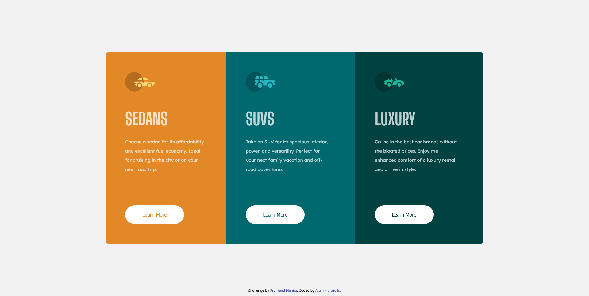
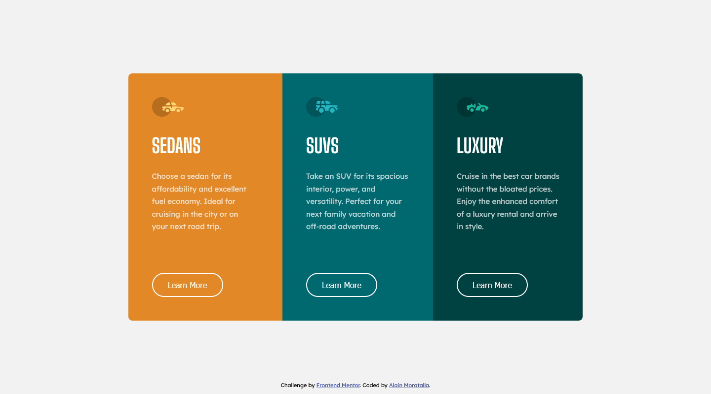
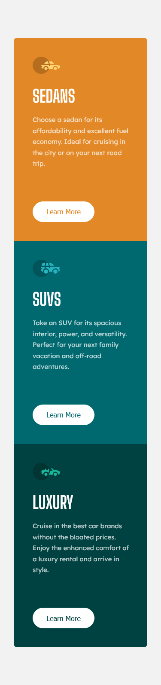

# Frontend Mentor - 3-column preview card component solution


This is a solution to the [3-column preview card component challenge on Frontend Mentor](https://www.frontendmentor.io/challenges/3column-preview-card-component-pH92eAR2-). Frontend Mentor challenges help you improve your coding skills by building realistic projects. 

---
## Table of contents

- [Frontend Mentor - 3-column preview card component solution](#frontend-mentor---3-column-preview-card-component-solution)
  - [Table of contents](#table-of-contents)
  - [Overview](#overview)
    - [The challenge](#the-challenge)
    - [Screenshots](#screenshots)
    - [Links](#links)
  - [My process](#my-process)
    - [Built with](#built-with)
    - [What I learned](#what-i-learned)
    - [Continued development](#continued-development)
    - [Useful resources](#useful-resources)
  - [Author](#author)
  - [Acknowledgments](#acknowledgments)

---

## Overview
Greetings Everyone! This project is made for the purpose of practicing and improving my CSS skills. 
This challenge is setup by [`Frontend Mentor`](https://www.frontendmentor.io/challenges/3column-preview-card-component-pH92eAR2-). To know more about this challenge, read the *challenge.md*.

### The challenge

Users should be able to:

- View the optimal layout depending on their device's screen size
- See hover states for interactive elements

**`Difficulty:`**` Newbie`

### Screenshots

Screen: `1440x800 desktop`


Screen: `1440x800 active state desktop`


Screen: `1920x966 desktop`


Screen: `375x1502 mobile`



### Links

- Solution URL: [Github repo url](https://github.com/almoratalla/3-column-preview-card-component)
- Live Site URL: [My Github page](https://almoratalla.github.io/projects/learning/3-column-preview-card-component)

## My process

### Built with

- Semantic HTML5 markup
- SCSS
- Flexbox
- Mobile-first workflow


### What I learned

The design of this 3-column preview card is relatively straight forward. I started with a `main` html element component with a class of `preview-card-component` as a parent to three containers which will hold all 3 column preview cards. In every `div` with class `card` container, I added the necessary contents for each cards; an `img` element, an `h1` element, a `p` element and a `button`.

For styling, I used a boilerplate I picked up from watching online video tutorials (links on the [Useful resources](#useful-resources) section). 

Starting with a mobile-first approach: 

```css
html {
    box-sizing: border-box;
    font-size: 100%;
}

*, *::before, *::after{
    box-sizing: inherit;
}

body {
    margin: 0;
    padding: 0;
    max-height: 100%;
}
```

Then started my way down adding flex box properties to my containers. 
I have two primary classes used for this project; `.preview-card-component` and `.card`.
After completing the needed properties for the mobile design, I started adding media queries for different screen sizes.

Since the given designs in the style-guide were created to `375px` and `1440px` for Mobile and Desktop respectively, I added these:

*@For screens* ~ `1366 x 768`, `1280 x 720` or `1440 x 800`
*body above* **`1232px * 624px`** *but not more than* **1600px**
```css
@media (min-width: 60em){
...
}
```

*@For screens* `1920 x 1080` 
*body* `1920px X 1076px/937px` *or* `120rem x 67.25rem/58.6rem`
```css
@media (min-width: 100em){
...
}
```

Lastly, for sizes relative to the original design, I estimated the sizes by pasting the `jpg` file into AdobeXD and eyeballed its dimensions. 

### Continued development

As of the writing of this markup, I would still want to make myself learn more about the best practices in writing stylesheets. At this point, I don't know if what I did with rewriting all my classes in to different media queries is a good practice or not but I can see it as an opportunity for continued development. 

Also, one thing I left out is the class `.attribution`. During screens above **60em**, the attribution will be visible at the bottom part of the page centered in its absolute glory. However, I used `position: absolute` for this and while it works, it doesn't look necessarily good in mobile. I guess the `.attribution` is optional in this challenge but I think it is still a good development opportunity for me especially since I often do a poor job at positioning footers.

### Useful resources

- [Frontendmentor.io](https://www.frontendmentor.io/resources) - Frontendmentor itself has a list of great resources!.
- [Coder Coder [youtube-channel]](https://youtu.be/FboXxLxg8eo) - This is an amazing web development video that features an FAQ accordion card challenge on Frontend Mentor as well. This project is inspired by this video. Also, I picked up a bit of my boiler plate styles from both this channel and [DesignCourse](https://www.youtube.com/user/DesignCourse)
- [MDN Web Docs](https://developer.mozilla.org/en-US/docs/Web/CSS/Reference) - Great reference for syntax and properties.
- [CSS Tricks!](https://css-tricks.com/snippets/css/a-guide-to-flexbox/) - Something I go back to as a reference for flexbox
- [Stack Overflow](https://stackoverflow.com/) - the ever loving!


## Author

- Website - [Alain Moratalla](https://github.com/almoratalla)
- Frontend Mentor - [@almoratalla](https://www.frontendmentor.io/profile/almoratalla)
- Twitter - [@almoratalla](https://twitter.com/almoratalla)


## Acknowledgments

I tip all the hats in the world for FrontEnd Mentor, their challenge and all the amazing references, resources and tutorials that help developers scratch the surface of the tip of the iceberg of web development knowledge.  
